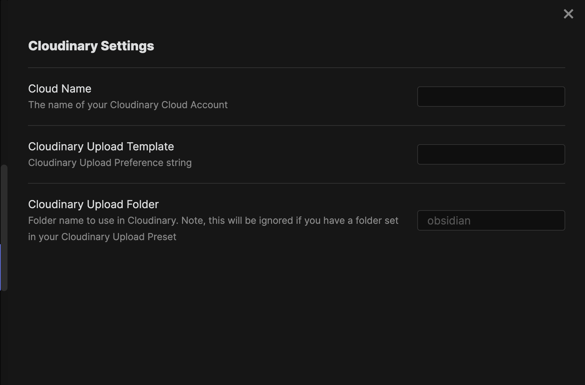

## Configuration Steps

To configure the Plugin, you'll need the following information:
- Cloudinary Cloud Name
- Cloudinary Upload Preset
- Cloudinary Folder Name

Continue to [Configuring Cloudinary](configuring-cloudinary.md)